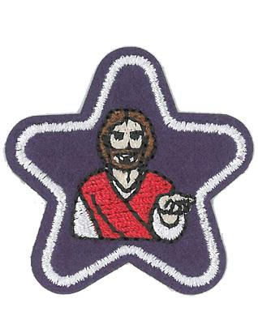

# Especialidades realizadas

Las especialidades para el nivel de *Corderitos* se llaman **estrellas**. Se han diseñado mas de 21 estrellas para animar a los niños de la clase a explorar, aprender y jugar.

Los requisitos de las estrellas que obtendrán los niños éste período forman parte de las reuniones de la clase.

En el nivel de Corderitos, es prerrogativa del líder (consejero o quien indique la directiva), decidir cuándo es que un niño ha cumplido con los requisitos de una especialidad. No todos los niños tendrán la habilidad de terminar con todos los requisitos de las estrellas y el programa como están escritos. Es más importante animar a los niños para que intenten hacer cosas nuevas y se diviertan, que competir  con otros para recibir más estrellas o frustrarse porque sus habilidades no les permite cumplir con los requisitos. La flexibilidad hará que la experiencia sea más agradable y positiva para los niños.

## Sábado 11 de Diciembre -- Mi Amigo Jesús --

**Estrellita obtenida: Mi Amigo Jesús**

{width=20%}

**Requisitos a cumplir:**

  - Escuchar un libro acerca de Jesús.
  - Cantar un canto acerca de Jesús.
  - Jugar un juego acerca de Jesús.
  - Aprender cómo Jesús creció ayudando/obedeciendo a sus padres.
  - Aprender a ser amigos con compañeros como lo fué Jesús.
  - Hacer una manualidad hacerca de Jesús.
  
### Actividad 1: Jesús fué bondadoso con sus amigos

Se le contó a los niños la historia de como Jesús era bondadoso con sus amigos los discípulos cuando lavaba sus pies después de largas caminatas. Mientras los niños escuchaban la historia dibujaron con apoyo de su acompañante la figura de sus pies en una hoja de papel en blanco, para facilitarles la conceptualización del aseo de los pies. La manualidad está anexada al cuaderno de trabajo de cada uno de los niños.

### Actividad 2: Jesús ayudó a sus amigos

Con ayuda de piezas de madera se les pidió a los niños que, así como Jesús ayudaba a su papá en la carpintería de la familia, ellos construyeran una casa cada quién. Al terminar el trabajo individual se les pidió que construyeran una casa juntos así como Jesús ayudaba y colaboraba (trabajaba en equipo) con sus amigos y los demás.

### Actividad 3: Jesús alimentó a sus amigos

Se utilizó agua de jamaica y vasos por separado para compartir con cada uno de los niños, mientras se les compartió un poco de la bebida se contó la historia de cómo Jesús alimentaba a sus amigos, con comida o, también, proveía bebida en las Bodas de Caná. La actividad se utilizó también como cierre del día. Se reforzó en los niños la idea de que Jesús alimentaba a sus amigos, así como ellos pueden ser generosos con sus amigos.

**ESTA ESTRELLITA SE CONSIDERA TERMINADA**

